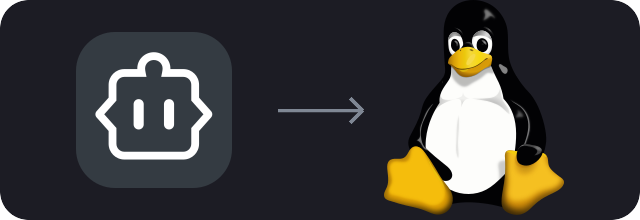
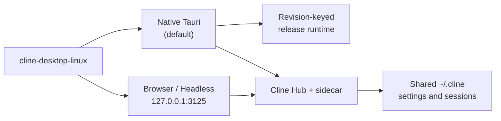

<div align="center">



<h1>cline-desktop-linux</h1>

<p><strong>Native-first Cline Desktop for Linux</strong><br/>
An unofficial Linux integration layer for the
<a href="https://github.com/cline/cline">open-source Cline project</a>.</p>

<a href="#one-command-install">Install</a> ·
<a href="#usage">Usage</a> ·
<a href="#upstream-compatibility">Compatibility</a> ·
<a href="#process-lifecycle">Lifecycle</a>

</div>

| Native default | Browser CLI fallback | Shared `~/.cline` state | No systemd service |
| --- | --- | --- | --- |
| Full Tauri desktop app | `cline-desktop-linux browser` | CLI, Desktop and Hub | Direct user process |

<a href="https://github.com/cline/cline">Upstream Cline</a> stays an ordinary
checkout. This project adds the Linux launcher, revision-keyed Native runtime
and desktop integration around it.

## Product shape

| Mode | Entry point | Purpose |
| --- | --- | --- |
| **Native** | `cline-desktop-linux` or the `Cline Desktop` menu entry | Default full desktop app using the staged Tauri release. |
| **Browser** | `cline-desktop-linux browser` | Fallback UI when browser rendering is preferable. |
| **Headless** | `cline-desktop-linux headless` | Development and integration server without a window. |



This project does **not** create a second Cline profile or replace the normal
`cline` CLI.

## Install

### One-command install

```bash
curl -fsSL https://raw.githubusercontent.com/nekomario28/cline-desktop-linux/main/bootstrap.sh | bash
```

The bootstrap downloads the repository archive and runs the normal installer.
It needs no GitHub CLI login, root privileges, or system service.

The installer reuses `~/Documents/cline-desktop` when present. Otherwise it
clones upstream Cline at the revision recorded in
`compat/cline-tested-revision.txt`, installs Bun 1.3.13 when needed, and builds
the Cline SDK. Existing upstream checkouts are never forcibly reset or
switched. Git, curl, Python 3 and Node.js 22+ must already be available.

Native source builds additionally need the normal Tauri Linux **build** stack: Rust/Cargo, `pkg-config`, GTK 3, WebKitGTK 4.1, libsoup 3 and JavaScriptCoreGTK 4.1. A verified prebuilt Release does not need that build stack. Browser/headless mode does not build the Rust desktop shell.

Native acquisition can be selected with `--native-source`:

- `auto` tries the latest verified GitHub Release first and falls back to a local source build when no Release is available;
- `prebuilt` requires the verified GitHub Release and never compiles Tauri locally;
- `build` always uses the current local Cline source checkout.

For example, after a tagged Release exists:

```bash
./install.sh --native-source prebuilt
```

Use `--native-release-tag v0.0.32-linux.1` to pin a specific Linux integration
Release. The
downloader verifies `SHA256SUMS`, the x86_64 archive contents, and the tested
Cline revision before updating `native/current`. The build toolchain is only
needed for `--native-source build` or the `auto` fallback when no Release is
available.

Tagged project releases provide real prebuilt Native assets built on the
local Linux system. The local release command publishes:

- the upstream Tauri `.deb` built from the exact tested Cline revision;
- a portable `x86_64.tar.gz` containing the same staged Native runtime;
- release metadata and `SHA256SUMS`.

Build and verify locally:

```bash
./scripts/release-native-local.sh --cline-source ~/Documents/cline-desktop
```

To upload the verified files from this machine, first push a SemVer tag. `gh`
must already be authenticated, and no remote runner is used:

```bash
git tag v0.0.32-linux.1
git push origin v0.0.32-linux.1
./scripts/release-native-local.sh --publish v0.0.32-linux.1
```

The app and package keep the upstream Cline Desktop version, such as `0.0.32`.
The Linux integration release tag adds the platform and packaging sequence.
The exact upstream commit remains recorded in release metadata and
`compat/cline-tested-revision.txt`.

The native build is cached under:

```text
native/releases/<Cline SHA>/
native/current -> releases/<Cline SHA>
```

Subsequent native launches use that release runtime directly. `desktop` is kept as an alias for `native`.

If an earlier local prototype installed a systemd user unit, the installer stops, disables and removes the known legacy units so they cannot return on the next login or contend with the direct launcher.

## Update

For an existing checkout:

```bash
CLDL_HOME="${XDG_DATA_HOME:-$HOME/.local/share}/cline-desktop-linux"; git -C "$CLDL_HOME" pull --ff-only && "$CLDL_HOME/install.sh"
```

## Usage

```bash
cline-desktop-linux              # start the native desktop app
cline-desktop-linux desktop      # explicit native desktop alias
cline-desktop-linux native       # release-built native Tauri UI
cline-desktop-linux browser      # browser fallback UI
cline-desktop-linux download-native # fetch/verify the tested GitHub Release
cline-desktop-linux build-native # explicitly build/cache current source revision
cline-desktop-linux headless     # development/integration server
cline-desktop-linux stop
cline-desktop-linux status
cline-desktop-linux doctor

cline-desktop-linux mode browser
cline-desktop-linux start

cline history                     # same Cline session store
cline doctor                      # same local Hub
```

KDE/application menus get:

- `Cline Desktop`

Native launches the staged release application directly and does not require the Browser endpoint. Start Browser explicitly with `cline-desktop-linux browser`; Browser/headless own the loopback development endpoint.

## Cline CLI data sharing

The integration leaves Cline's own storage environment untouched. With the normal local setup, both the upstream Desktop app and the `cline` CLI use the same Cline state under `~/.cline`, including provider/auth settings, session history and the local Hub.

```bash
cline history
cline doctor
```

That means a session or provider setting created through one Cline client remains available to the other when upstream Cline supports that cross-client state. `cline-desktop-linux` does not set a separate `CLINE_DIR` or session-data directory.

## Browser vs Native

The upstream Desktop product is distributed as a native app on macOS and Windows. This Linux integration follows that product shape: Native is the default, while Browser remains an explicit fallback when WebKitGTK/Tauri rendering feels less smooth or text looks worse on a particular Wayland/HiDPI setup. Browser mode uses the same Desktop sidecar/Hub/session stack, but delegates rendering, zoom and font rasterization to the user's browser.

Native mode is a first-class release runtime. `scripts/build-native.sh` runs upstream's Tauri release build with the `.deb` bundle target, extracts the bundle without installing it system-wide, verifies `cline-app` and `code-sidecar`, records the exact Cline revision/version and source bundle SHA-256, then atomically updates `native/current`.

Automatic native launch is conservative around upstream changes. If the current Cline checkout differs from the recorded tested revision, an already-cached tested native runtime remains the default. If no tested cache exists, automatic native building refuses the untested checkout. Running `cline-desktop-linux build-native` is the explicit opt-in to build a compatible-but-untested revision.

For a fresh clone you can select another upstream ref explicitly:

```bash
./install.sh --cline-ref main
./install.sh --cline-ref <tag-or-sha>
```

The compatibility checker still runs. A custom ref does not become the recorded tested revision until it is promoted deliberately.

## Upstream compatibility

`compat/cline-tested-revision.txt` records the exact upstream Cline commit known to satisfy this integration's source and release-runtime contracts. `scripts/check-cline-compat.sh` checks the Desktop app layout, Bun/Node assumptions, Tauri `externalBin` sidecar contract, frontend distribution contract and `CLINE_CODE_SIDECAR_BIN` integration point.

Compatibility checks and release builds run locally on the pinned Cline source.
`scripts/check-cline-compat.sh` validates the source contract, while
`scripts/release-native-local.sh` validates the complete package and portable
runtime before an optional local `gh release` upload.

Promotion procedure and claim boundaries are documented in `compat/README.md`.

Distributable Native assets are defined by
`scripts/package-release-native.sh` and
`scripts/release-native-local.sh`. Release packaging refuses any Cline
revision other than `compat/cline-tested-revision.txt`.

## Process lifecycle

The complete desktop app is launched directly as the logged-in user. Browser/headless and Native modes use PID files and logs under the XDG state directory, and `stop` terminates only processes owned by this integration. No systemd user service is installed. Updating or stopping also cleans up units left by older versions.

## Upstream and trademark notice

This is an independent, unofficial integration project and is not affiliated with or endorsed by Cline Bot Inc. `Cline` is used only to identify compatibility with the upstream project. Upstream Cline source and branding are obtained from the user's own Cline checkout and remain subject to upstream licensing and trademark terms.
